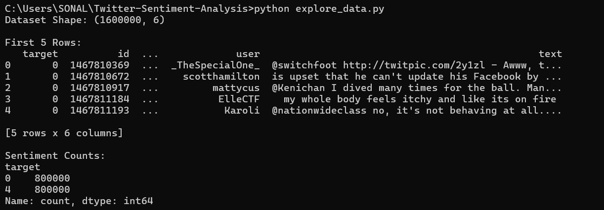
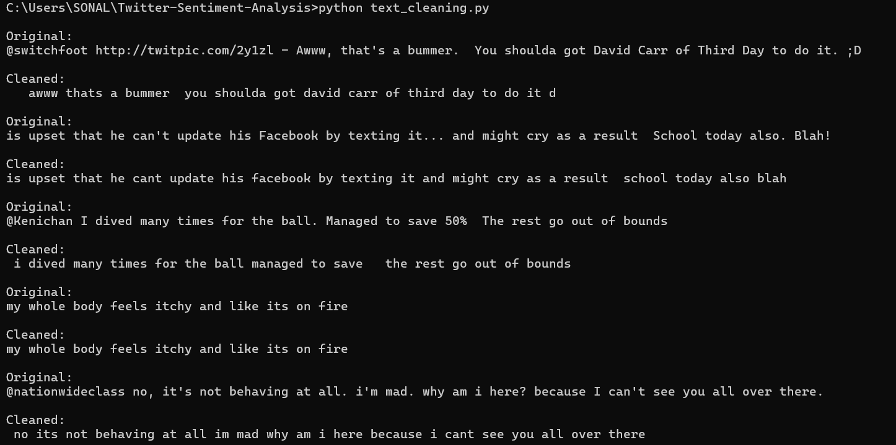
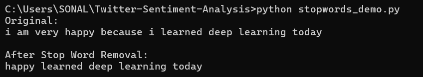
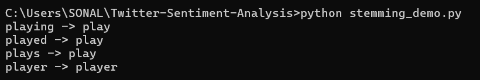
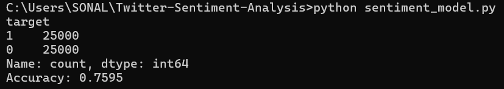
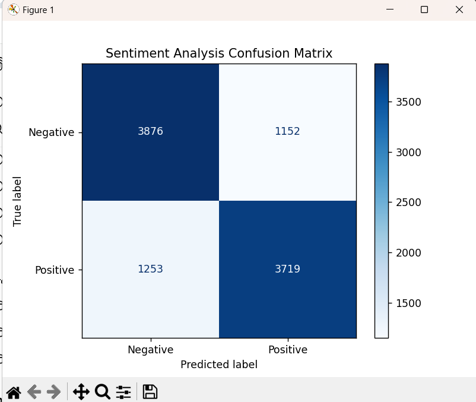

# Twitter Sentiment Analysis using Machine Learning

## Overview

This project performs Sentiment Analysis on Twitter data using Natural Language Processing (NLP) and Machine Learning techniques. The model classifies tweets as Positive or Negative based on their textual content.

The project demonstrates the complete NLP workflow, including text preprocessing, feature extraction using TF-IDF, model training using Naive Bayes, and performance evaluation using accuracy and a confusion matrix.

---

## Features

* Twitter sentiment classification
* Text preprocessing and cleaning
* Stop word removal
* Word stemming
* TF-IDF feature extraction
* Naive Bayes classification
* Model evaluation using accuracy score
* Confusion Matrix visualization

---

## Technologies Used

* Python
* Pandas
* NumPy
* NLTK
* Scikit-learn
* Matplotlib

---

## Dataset

The project uses the Sentiment140 Twitter dataset.

Dataset Information:

* Total Tweets: 1,600,000
* Negative Tweets: 800,000
* Positive Tweets: 800,000

Sentiment Labels:

* 0 → Negative
* 4 → Positive

For model training, a balanced dataset of 50,000 tweets was created:

* 25,000 Negative Tweets
* 25,000 Positive Tweets

### Dataset Download

The dataset used in this project is too large to be included in this repository.

Download the Sentiment140 dataset from:

https://www.kaggle.com/datasets/kazanova/sentiment140

After downloading, place the CSV file in the project root directory before running the scripts.

---

## NLP Concepts Implemented

### Text Cleaning

The following preprocessing steps were performed:

* Convert text to lowercase
* Remove URLs
* Remove Twitter mentions
* Remove special characters and punctuation

### Stop Word Removal

Common words such as:

* is
* am
* the
* and
* to

were removed to retain meaningful information.

### Stemming

Words with the same root meaning were reduced to a common form.

Examples:

* playing → play
* played → play
* plays → play

### TF-IDF Vectorization

TF-IDF converts text into numerical features that can be used by machine learning algorithms.

---

## Machine Learning Model

Algorithm Used:

* Multinomial Naive Bayes

Why Naive Bayes?

* Fast and efficient
* Performs well on text classification tasks
* Commonly used in sentiment analysis and spam filtering

---

## Project Structure

Twitter-Sentiment-Analysis/

├── explore_data.py

├── text_cleaning.py

├── stopwords_demo.py

├── stemming_demo.py

├── sentiment_model.py

├── requirements.txt

├── README.md

└── screenshots/

    ├── 01_dataset_exploration.png

    ├── 02_text_cleaning.png

    ├── 03_stopword_removal.png

    ├── 04_stemming_demo.png

    ├── 05_model_accuracy.png

    └── 06_confusion_matrix.png

---

## Installation

Clone the repository:

```bash
git clone <repository-url>
cd Twitter-Sentiment-Analysis
```

Install dependencies:

```bash
pip install -r requirements.txt
```

---

## Running the Project

### Explore Dataset

```bash
python explore_data.py
```

### Text Cleaning

```bash
python text_cleaning.py
```

### Stop Word Removal

```bash
python stopwords_demo.py
```

### Stemming Demonstration

```bash
python stemming_demo.py
```

### Train and Evaluate Model

```bash
python sentiment_model.py
```

---

## Results

Model Accuracy:

```text
75.95%
```

The model successfully learns sentiment patterns from tweets using NLP preprocessing and TF-IDF features.

---

## Screenshots

### Dataset Exploration



### Text Cleaning



### Stop Word Removal



### Stemming Demonstration



### Model Accuracy



### Confusion Matrix



---

## Learning Outcomes

Through this project, I learned:

* Natural Language Processing (NLP)
* Text preprocessing techniques
* Stop word removal
* Stemming
* TF-IDF feature extraction
* Machine Learning classification
* Naive Bayes algorithm
* Model evaluation techniques
* Confusion Matrix analysis

---

## Future Improvements

* Add Neutral sentiment classification
* Use Logistic Regression and SVM for comparison
* Apply Deep Learning using LSTM networks
* Create a web interface for real-time sentiment prediction

---

## Author

Sonal Patani

AI Internship Project Submission
